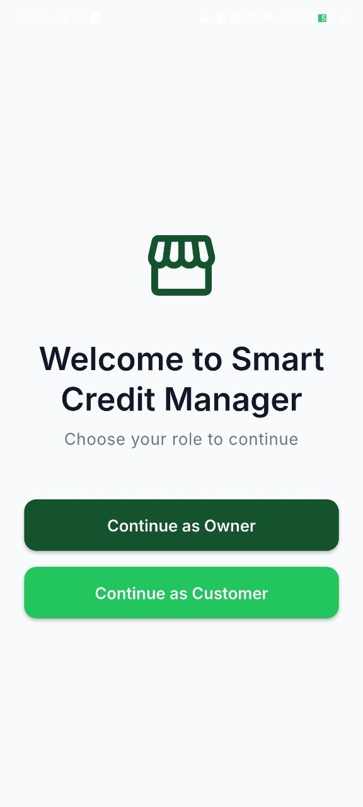
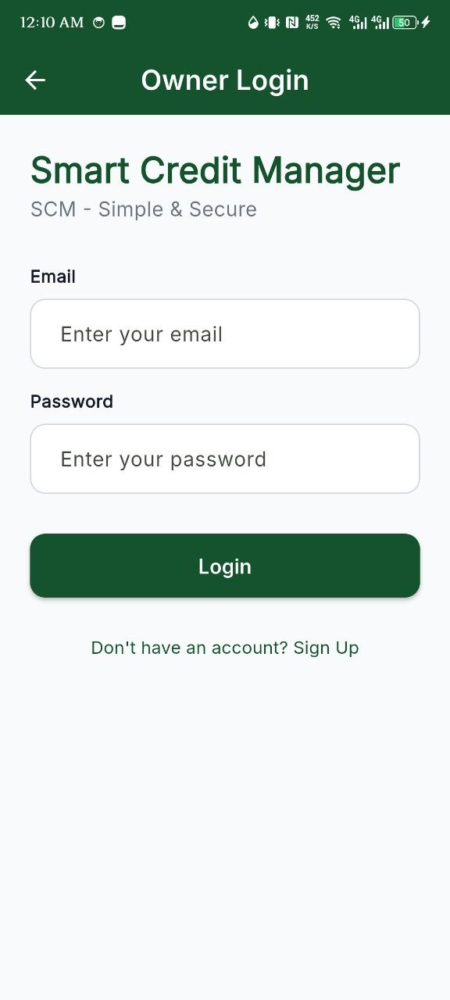
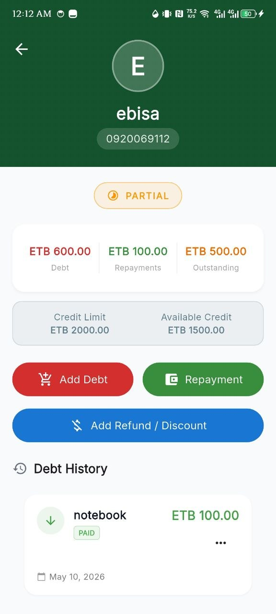
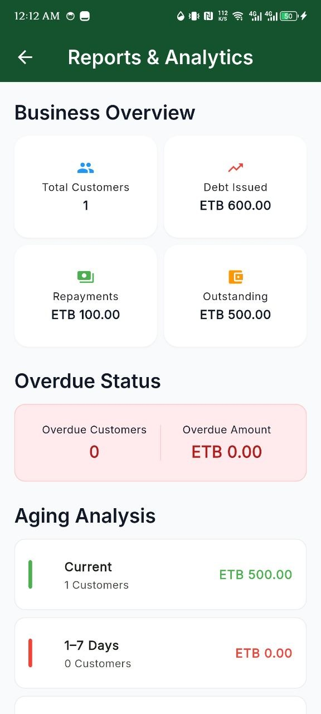
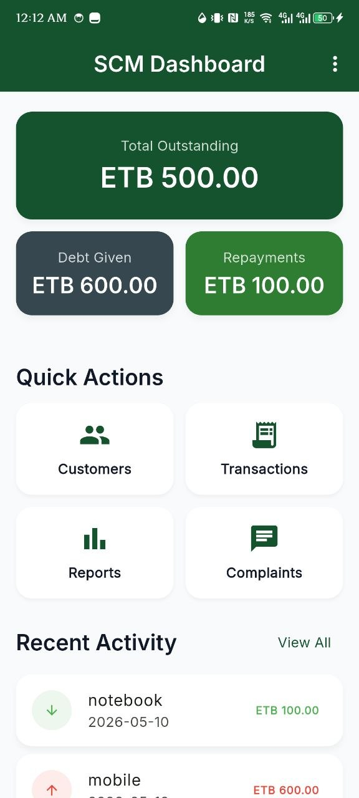
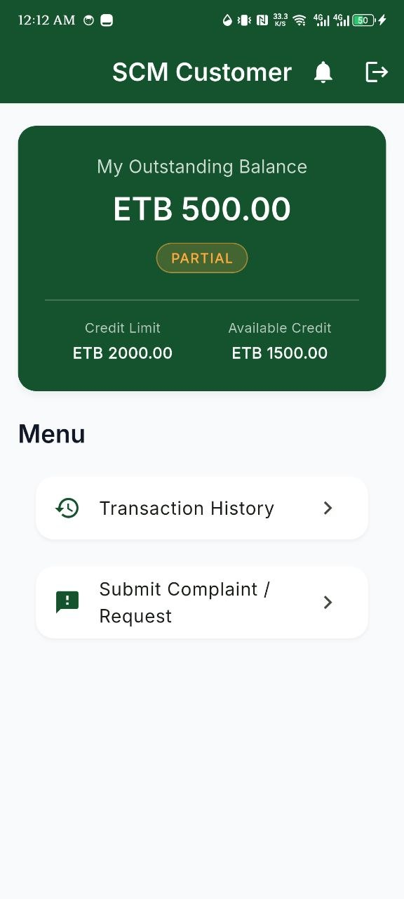

<div align="center">
  <h1>📱 Smart Credit Manager (SCM)</h1>
  <p><em>Digitally manage customer credit, repayments, overdue balances, reminders, and reports for Ethiopian local shops.</em></p>
  
  [](https://flutter.dev/)
  [](https://dart.dev/)
  [](https://supabase.com/)
</div>

---

## 📖 Project Description

**Smart Credit Manager (SCM)** is a robust, production-ready mobile application tailored for local shops and mini-markets in Ethiopia. It replaces traditional paper-based ledger books with a secure, digital platform to track customer credit, handle repayments, manage refunds, and monitor overdue balances. 

With dedicated interfaces for both Shop Owners and Customers, the application ensures transparent and accurate financial tracking. Owners can analyze credit aging, send reminders, and view comprehensive reports, while customers can track their real-time balances and transaction history.

---

## ✨ Features

* **Role-Based Access Control:** Secure, isolated interfaces for Shop Owners and Customers.
* **Transaction Ledger:** Detailed recording of all credits, repayments, and refunds.
* **Customer Credit Limits:** Define maximum credit thresholds for individual customers.
* **Overdue Tracking & Reminders:** Automated aging analysis and overdue payment reminders.
* **Live Balance Calculations:** Real-time updates of customer balances in local currency (ETB/Br).
* **Comprehensive Reports:** Visual dashboards and detailed reporting for store owners.
* **Account Isolation & Security:** Strong database policies ensuring data privacy between users.

---

## 📸 App Showcase

<div align="center">
  <table>
    <tr>
      <td align="center"><b>Login & Role Selection</b><br></td>
      <td align="center"><b>Dashboard</b><br></td>
      <td align="center"><b>Customer Ledger</b><br></td>
    </tr>
    <tr>
      <td align="center"><b>Reports</b><br></td>
      <td align="center"><b>Aging Analysis</b><br></td>
      <td align="center"><b>Reminder System</b><br></td>
    </tr>
  </table>
</div>

---

## 🛠 Tech Stack

* **Framework:** Flutter (Dart)
* **Backend as a Service (BaaS):** Supabase (PostgreSQL)
* **Authentication:** Supabase Auth (Role-Based)
* **State Management:** Riverpod
* **Navigation:** GoRouter
* **Local Storage / Caching:** Shared Preferences
* **UI/UX:** Custom modern fintech-style theme (Material 3)

---

## 🏗 Architecture / Project Structure

The project follows a **Feature-First Architecture** combined with Riverpod for state management. This ensures modularity, scalability, and easy maintenance.

### 📁 Folder Structure

```text
lib/
├── core/               # Shared utilities, theme, and constants
│   ├── theme/          # App colors, typography, and theme definitions
│   └── utils/          # Helper functions and formatters
├── data/               # Data layer (models, repositories, data sources)
│   ├── models/         # Data models (Transaction, Customer, etc.)
│   └── repositories/   # Supabase database interactions
├── features/           # Feature-based modular code
│   ├── auth/           # Authentication and role selection
│   ├── customer/       # Customer-specific screens (Dashboard, History)
│   └── owner/          # Owner-specific screens (Ledger, Complaints, Reports)
├── Images/             # Application screenshots and assets
└── main.dart           # Application entry point
```

---

## ⚙️ Configuration Requirements

To run this project, you need a **Supabase** backend configured.

1. Create a Supabase project at [database.supabase.com](https://supabase.com).
2. Execute the provided `supabase_schema.sql` file in the Supabase SQL Editor to set up the tables, Row Level Security (RLS) policies, and triggers.
3. Configure your local environment variables (see Installation).

---

## 🚀 Installation Instructions

### Prerequisites
* [Flutter SDK](https://docs.flutter.dev/get-started/install) (v3.19+ recommended)
* Dart SDK
* A code editor like VS Code or Android Studio

### 1. Clone the Repository
```bash
git clone https://github.com/yourusername/smart_credit_management_app.git
cd smart_credit_management_app
```

### 2. Install Dependencies
```bash
flutter pub get
```

### 3. Setup Environment Variables
Copy the example environment file and update it with your Supabase credentials.
```bash
cp .env.example .env
```
Edit `.env` to include your Supabase URL and Anon Key:
```env
SUPABASE_URL=your_supabase_project_url
SUPABASE_ANON_KEY=your_supabase_anon_key
```

### 4. Running the App
```bash
# Run on connected device or emulator
flutter run
```

---

## 🧠 Core Business Logic Overview

The SCM app enforces strict business rules for financial consistency:
* **Transactions:** All credits, repayments, and refunds are immutable records in the `transactions` table.
* **Balance Calculation:** Customer balances are dynamically derived or securely synchronized via Supabase triggers to prevent frontend manipulation.
* **Role Separation:** Data access is strictly controlled via Supabase Row Level Security (RLS). Owners can only see their shop's data; customers can only see their personal ledger.

---

## 🔑 Key Features Breakdown

* **Customer Credit Limits:** Owners can set customized credit limits. Transactions exceeding this limit are flagged or blocked.
* **Transaction Ledger:** A chronological, double-entry style ledger tracking all financial interactions.
* **Repayments & Refunds:** Distinct transaction types handled accurately to update the total outstanding balance.
* **Overdue Tracking:** The system calculates the age of unpaid credits and categorizes them (e.g., 30, 60, 90+ days overdue).

---

## 🗄 Database / Authentication Overview

The database relies on **Supabase PostgreSQL**.

* **Authentication:** Supabase Auth manages user credentials. Custom claims or metadata define user roles (`owner` vs. `customer`).
* **Schema:** Core tables include `users`, `customers`, and `transactions`.
* **Security:** Extensive RLS policies guarantee account isolation, ensuring users cannot query or modify data belonging to another shop or customer.

---

## 🚧 Challenges Solved

* **Data Consistency:** Resolved race conditions and calculation errors by moving critical aggregate operations to database triggers instead of client-side Dart code.
* **Cascading Deletions:** Fixed authentication deletion flows to ensure associated financial records are securely wiped or archived when an account is removed.
* **Complex UI State:** Migrated to Riverpod to handle live updates across multiple screens without redundant network calls or UI jank.

---

## 🔮 Future Improvements

* **Offline Support:** Implement local caching (e.g., Hive or Isar) to allow shop owners to log transactions without internet, syncing when online.
* **SMS Notifications:** Integrate a local SMS gateway to send automated payment reminders directly to customers' phones.
* **Export to PDF/Excel:** Allow owners to export financial reports for accounting and tax purposes.

---

## 🤝 Contribution

Contributions are welcome! Please follow these steps:
1. Fork the repository.
2. Create your feature branch (`git checkout -b feature/AmazingFeature`).
3. Commit your changes (`git commit -m 'Add some AmazingFeature'`).
4. Push to the branch (`git push origin feature/AmazingFeature`).
5. Open a Pull Request.

---

## 📄 License

Distributed under the MIT License. See `LICENSE` for more information.

---

## 👨‍💻 Author / Developer

**[Ebisa Getachew ]**  
*Full Stack Developer | Mobile App Specialist*

- GitHub: [https://github.com/e-b-b-o](https://github.com/e-b-b-o)
- Email: ebisagetachew1243@gmail.com

---
*This project is designed for professional presentation, portfolio showcase, and academic submission.*
